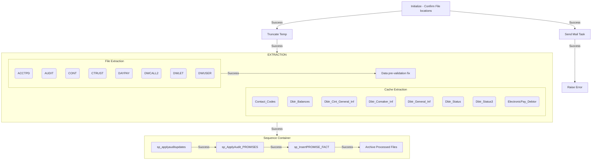

&nbsp;

---

## Package Info

| Property              | Value                    |
| --------------------- | ------------------------ |
| Package Name          | DW_Daily_Extraction      |
| Project               | DWDailyUpdate            |
| Created By            | CORP\\vladislav.pilipets |
| Created Date          | 10/31/2019 8:58:12 PM    |
| Last Modified Version | 15.0.0900.40             |

---

## Description

The DW_Daily_Extraction package orchestrates the nightly ingestion of several flat‑file sources that contain account, audit, contract, trust, daily payment, and call‑detail records. It begins by verifying that the expected files are present in the designated queue folder and then proceeds to move the data into a staging area. Each source file is read, and its contents are transformed to conform to the warehouse’s staging table structures—removing unwanted characters, aligning column mappings, and handling any malformed rows by diverting them to error files. The cleaned data is inserted into a set of temporary tables that hold debtor balances, client general information, comaker details, status information, electronic payer records, and contact codes. After the staging tables are populated, the package invokes a series of stored procedures that apply audit updates, process promise‑related data, and insert the final fact records into the data warehouse. Throughout the flow, any records that fail validation are captured in separate error flat files for later review. Finally, the package archives the processed source files and cleans up the temporary tables, readying the environment for the next execution cycle. The overall purpose is to reliably extract, cleanse, and load daily operational data into the warehouse for reporting and analysis.

---

## Variables

| Variable               | Value                                                  |
| ---------------------- | ------------------------------------------------------ |
| ArchiveFolder          | S:\\NIGHT JOBS FILE BACKUP\\DW_Daily_Update\\Archive\\ |
| bFilesExist            | \-1                                                    |
| bReplay                | \-1                                                    |
| Incoming_Contact_Codes | 0                                                      |
| Incoming_Day_Pay       | 0                                                      |
| Incoming_DW_Call       | 0                                                      |
| mailIP                 | 10.99.14.12                                            |
| nDay                   | 0                                                      |
| nDays                  | \-5                                                    |
| QueueFolder            | S:\\NIGHT JOBS FILE BACKUP\\DW_Daily_Update\\Queue\\   |
| SourceFolder           | O:                                                     |
| SourceFolderAlt        | \\msfacs\\DW                                           |
| Variable               | 0                                                      |

---

## Connections

| Name                       | Type                      | Connection String                                                                                                        |
| -------------------------- | ------------------------- | ------------------------------------------------------------------------------------------------------------------------ |
| ACCTPD.TXT                 | Flat File                 | S:\\NIGHT JOBS FILE BACKUP\\DW_Daily_Update\\Queue\\ACCTPD.TXT                                                           |
| AUDIT.TXT                  | Flat File                 | S:\\NIGHT JOBS FILE BACKUP\\DW_Daily_Update\\Queue\\AUDIT.TXT                                                            |
| Audit_Error                | Flat File                 | \\DFW2-BISQL-001\\SSISFlatFileStage\\NIGHT JOBS FILE BACKUP\\DW_Daily_Update\\Error\\Audit_Error.txt                     |
| CONT.TXT                   | Flat File                 | S:\\NIGHT JOBS FILE BACKUP\\DW_Daily_Update\\Queue\\CONT.TXT                                                             |
| CTRUST.TXT                 | Flat File                 | S:\\NIGHT JOBS FILE BACKUP\\DW_Daily_Update\\Queue\\CTRUST.TXT                                                           |
| DAYPAY.TXT                 | Flat File                 | S:\\NIGHT JOBS FILE BACKUP\\DW_Daily_Update\\Queue\\DAYPAY.TXT                                                           |
| Dbtr_General_Inf_Error     | Flat File                 | \\dfw2-bisql-001\\SSISFlatFileStage\\NIGHT JOBS FILE BACKUP\\DW_Daily_Update\\Error\\Dbtr_General_Inf_Error.txt          |
| DEF CACHE                  | [ADO.NET](http://ADO.NET) | server=msfacs;uid=ETL;Dsn=CacheDEF;port=1972;database=DEF;authentication method=0;static cursors=0;query timeout=1;unico |
| DWCALL.TXT                 | Flat File                 | S:\\NIGHT JOBS FILE BACKUP\\DW_Daily_Update\\Queue\\DWCALL.TXT                                                           |
| DWLET.TXT                  | Flat File                 | S:\\NIGHT JOBS FILE BACKUP\\DW_Daily_Update\\Queue\\DWLET.TXT                                                            |
| DWUSER.TXT                 | Flat File                 | S:\\NIGHT JOBS FILE BACKUP\\DW_Daily_Update\\Queue\\DWUSER.TXT                                                           |
| DW_MSTR_DM                 | [ADO.NET](http://ADO.NET) | Data Source=dfw2-BISQL-001;Initial Catalog=DW_MSTR_DM;Integrated Security=True;Application Name=SSIS-DWDailyUpdate-{9B02 |
| DW_MSTR_DM OLEDB           | OLE DB                    | Data Source=dfw2-BISQL-001;Initial Catalog=DW_MSTR_DM;Provider=SQLNCLI11.1;Integrated Security=SSPI;Auto Translate=False |
| DW_STAGING                 | [ADO.NET](http://ADO.NET) | Data Source=dfw2-BISQL-001;Initial Catalog=DW_STAGING;Integrated Security=True;Application Name=SSIS-DWDailyUpdate-{223A |
| DW_STAGING OLEDB           | OLE DB                    | Data Source=dfw2-BISQL-001;Initial Catalog=DW_STAGING;Provider=SQLNCLI11.1;Integrated Security=SSPI;Auto Translate=False |
| ElectronicPay_Debtor_Error | Flat File                 | S:\\LOG\\ElectronicWebpayor_errors.csv                                                                                   |
| SMTP                       | SMTP                      | SmtpServer=10.99.14.12;UseWindowsAuthentication=False;EnableSsl=False;                                                   |
| Test_Dbtr_General_Inf      | Flat File                 | \\dfw2-bisql-001\\SSISFlatFileStage\\000_oneoff\\Test_Dbtr_General_Inf.csv                                               |

---

## File Sources

| File                       | Path                                                                                                            |
| -------------------------- | --------------------------------------------------------------------------------------------------------------- |
| ACCTPD.TXT                 | S:\\NIGHT JOBS FILE BACKUP\\DW_Daily_Update\\Queue\\ACCTPD.TXT                                                  |
| AUDIT.TXT                  | S:\\NIGHT JOBS FILE BACKUP\\DW_Daily_Update\\Queue\\AUDIT.TXT                                                   |
| Audit_Error                | \\DFW2-BISQL-001\\SSISFlatFileStage\\NIGHT JOBS FILE BACKUP\\DW_Daily_Update\\Error\\Audit_Error.txt            |
| CONT.TXT                   | S:\\NIGHT JOBS FILE BACKUP\\DW_Daily_Update\\Queue\\CONT.TXT                                                    |
| CTRUST.TXT                 | S:\\NIGHT JOBS FILE BACKUP\\DW_Daily_Update\\Queue\\CTRUST.TXT                                                  |
| DAYPAY.TXT                 | S:\\NIGHT JOBS FILE BACKUP\\DW_Daily_Update\\Queue\\DAYPAY.TXT                                                  |
| Dbtr_General_Inf_Error     | \\dfw2-bisql-001\\SSISFlatFileStage\\NIGHT JOBS FILE BACKUP\\DW_Daily_Update\\Error\\Dbtr_General_Inf_Error.txt |
| DWCALL.TXT                 | S:\\NIGHT JOBS FILE BACKUP\\DW_Daily_Update\\Queue\\DWCALL.TXT                                                  |
| DWLET.TXT                  | S:\\NIGHT JOBS FILE BACKUP\\DW_Daily_Update\\Queue\\DWLET.TXT                                                   |
| DWUSER.TXT                 | S:\\NIGHT JOBS FILE BACKUP\\DW_Daily_Update\\Queue\\DWUSER.TXT                                                  |
| ElectronicPay_Debtor_Error | S:\\LOG\\ElectronicWebpayor_errors.csv                                                                          |
| Test_Dbtr_General_Inf      | \\dfw2-bisql-001\\SSISFlatFileStage\\000_oneoff\\Test_Dbtr_General_Inf.csv                                      |

---

## Control Flow



---

## Data Flow

### Contact_Codes

| Component         | Type             | Detail                                                                                                                             |
| ----------------- | ---------------- | ---------------------------------------------------------------------------------------------------------------------------------- |
| Contact_Code      | OLEDBDestination | \[dbo\].\[Contact_Code\]                                                                                                           |
| Data Conversion   | DataConvert      | Converts: Copy of Contact_Code1 (wstr), Copy of CONTACT_DESC (wstr), Copy of GC_Statistic_Type (wstr), Copy of Contact_Code (wstr) |
| DEF_Contact_Codes | OLEDBSource      | select \* from \[DEF\]..\[SQLUser\].\[Contact_Codes\]                                                                              |
| Row Count         | RowCount         | Row count → User::Incoming_Contact_Codes                                                                                           |

### Dbtr_Balances

| Component         | Type                 | Detail                                                                                                                                                                                                                                                                                                                                                                                                                                                                                                                                                                                                                                                                                                                                                                                                                                                                                                                                                                                                                                                                             |
| ----------------- | -------------------- | ---------------------------------------------------------------------------------------------------------------------------------------------------------------------------------------------------------------------------------------------------------------------------------------------------------------------------------------------------------------------------------------------------------------------------------------------------------------------------------------------------------------------------------------------------------------------------------------------------------------------------------------------------------------------------------------------------------------------------------------------------------------------------------------------------------------------------------------------------------------------------------------------------------------------------------------------------------------------------------------------------------------------------------------------------------------------------------- |
| Data Conversion   | DataConvert          | Converts: DBACCT (str), DBBAL (str), ACCTBAL (str), AGYBAL (str), ACCTPDA (str) +33 more                                                                                                                                                                                                                                                                                                                                                                                                                                                                                                                                                                                                                                                                                                                                                                                                                                                                                                                                                                                           |
| Dbtr_Balances     | ManagedComponentHost | SELECT A.ACCOUNT_NUM, A.ACCOUNT_BALANCE, A.ACCT_BAL_CLIENT, A.AGENCY_BALANCE, A.AMT_PAID_ON_ACCT, A.AGY_INT_BALANCE, A.Add_On_Charge_List_4, A.COURT_COST_BALANCE, A.CREDIT_BALANCE, A.INITIAL_BALANCE, A.INITIAL_LIST3, A.INITIAL_LIST4, A.INITL_INTEREST, A.INTEREST_BALANCE, A.INT_NON_CASH_CREDIT, A.LIST3_BALANCE, A.LIST4_BALANCE, A.LISTED_MISC1, A.LST3_NON_CASH_CREDIT, A.LST4_NON_CASH_CREDIT, A.ATTORNEY_FEE_BALANCE, A.MISC1_BALANCE, A.PJ_INTEREST_BALANCE, A.PRINCIPAL_BALANCE, A.PRN_NON_CASH_CREDIT, A.ROUTE_BALANCE, A.RTE_ATY_BAL, A.RTE_A_INT_BAL, A.RTE_CC_BAL, A.RTE_INTEREST_BAL, A.RTE_LIST3_BAL, A.RTE_LIST4_BAL, A.RTE_MISC1_BAL, A.RTE_PJ_INT_BAL, A.RTE_PRN_BAL, A.RTE_BAL_CLIENT, A.Route_AInt_Cancel, A.Route_Cancel_Amount FROM SQLUser.Dbtr_Balances  A JOIN SQLUser.Dbtr_Clnt_Generl_Inf C ON(A.ACCOUNT_NUM = C.ACCOUNT_NUM) WHERE C.DATE_LISTED >= DATEADD(D, -5, CURRENT_DATE)  AND C.DATE_LISTED < DATEADD(D, 0, CURRENT_DATE) AND C.CLIENT NOT LIKE '9%' AND C.CLIENT NOT LIKE 'LCI%' AND C.CLIENT NOT LIKE 'Z%'  AND A.ACCOUNT_NUM != 2207301 |
| TMP_Dbtr_Balances | OLEDBDestination     | \[dbo\].\[TMP_Dbtr_Balances\]                                                                                                                                                                                                                                                                                                                                                                                                                                                                                                                                                                                                                                                                                                                                                                                                                                                                                                                                                                                                                                                      |

### Dbtr_Cint_General_Inf

| Component                | Type                 | Detail                                                                                         |
| ------------------------ | -------------------- | ---------------------------------------------------------------------------------------------- |
| Data Conversion          | DataConvert          | Converts: DBCLNT (str), DBCLACCT (str), DBINCDTE (str), DBDLQDTE (str), DBLSTDTE (str) +3 more |
| Dbtr_CInt_General_Inf    | ManagedComponentHost | SELECT A.Client, LEFT(A.AcctNUM_From_Client,1)                                                 |
| TMP_Dbtr_Clnt_Generl_Inf | OLEDBDestination     | \[dbo\].\[TMP_Dbtr_Clnt_Generl_Inf\]                                                           |

### Dbtr_Comaker_Inf

| Component            | Type                 | Detail                                                                                                                                                                                                                                                                                                                                                                                                                                                                                                                                                                                                                                                                                                                                                                                                                                                                                                                                                                                                                                                                                                                                                                                                                                                                                                               |
| -------------------- | -------------------- | -------------------------------------------------------------------------------------------------------------------------------------------------------------------------------------------------------------------------------------------------------------------------------------------------------------------------------------------------------------------------------------------------------------------------------------------------------------------------------------------------------------------------------------------------------------------------------------------------------------------------------------------------------------------------------------------------------------------------------------------------------------------------------------------------------------------------------------------------------------------------------------------------------------------------------------------------------------------------------------------------------------------------------------------------------------------------------------------------------------------------------------------------------------------------------------------------------------------------------------------------------------------------------------------------------------------- |
| Data Conversion      | DataConvert          | Converts: DBACCT (decimal), DCBCCK (str), DCCART (str), DCADD1 (str), DCADD2 (str) +28 more                                                                                                                                                                                                                                                                                                                                                                                                                                                                                                                                                                                                                                                                                                                                                                                                                                                                                                                                                                                                                                                                                                                                                                                                                          |
| Dbtr_Comaker_Inf     | ManagedComponentHost | SELECT A.ACCOUNT_NUM1 AS DBACCT, A.BAR_CODE_CHECK AS DCBCCK, A.CARRIER_ROUTE AS DCCART, SUBSTRING(A.Comak_Address1, 0, 21) AS DCADD1, SUBSTRING(A.Comak_Address2, 0, 21) AS DCADD2, A.Comak_City AS DCCITY, A.Comak_Drv_LicNUM AS DCDRVLIC, A.Comak_FIRST_Name AS DCFIRST, A.Comak_Lastname AS DCLAST, A.Comak_Misc AS DCMISC, A.Comak_Phe_Flg AS DCPF, A.Comak_PhoneNUM AS DCPHONE, A.Comak_Poe AS DCPOE, A.Comak_Poestate AS DCPST, A.Comak_Poe_Addr AS DCPADD1, A.Comak_Poe_City AS DCPCITY, A.Comak_Poe_PhNUM AS DCPPHNE, A.Comak_Poe_Zip AS DCPZIP, A.Comak_Resp AS DCRP, A.Comak_Socsec AS DCSSN, A.Comak_State AS DCSTATE, A.Comak_Zip_Code AS DCZIP, A.COUNTY_CODE AS DCCNTY, A.Co_Poe_Phe_Flg AS DCPPF, A.Credit_Report AS DCCRDRPT, A.Delivery_Point AS DCDELV, A.METRO_FIRST_NAME AS DCMFRST, A.METRO_SOC_SECNUM AS DCMSSN, A.Poe_Bar_Code_Ck AS DCPBCCK, A.POE_CARRIER_RTE AS DCPCART, A.POE_COUNTY_CODE AS DCPCNTY, A.Poe_Delivery_Pt AS DCPDELV, C.DATE_LISTED AS DBLSTDTI FROM SQLUSER.Dbtr_Comaker_Inf A JOIN SQLUSER.Dbtr_Clnt_Generl_Inf C ON(A.ACCOUNT_NUM = C.ACCOUNT_NUM) WHERE C.DATE_LISTED >= DATEADD(D, -5, CURRENT_DATE)  AND C.DATE_LISTED < DATEADD(D, 0, CURRENT_DATE) AND C.CLIENT NOT LIKE '9%' AND C.CLIENT NOT LIKE 'LCI%' AND C.CLIENT NOT LIKE 'Z%'  AND A.ACCOUNT_NUM != 2207301 |
| TMP_Dbtr_Comaker_Inf | OLEDBDestination     | \[dbo\].\[TMP_Dbtr_Comaker_Inf\]                                                                                                                                                                                                                                                                                                                                                                                                                                                                                                                                                                                                                                                                                                                                                                                                                                                                                                                                                                                                                                                                                                                                                                                                                                                                                     |

### Dbtr_General_Inf

| Component            | Type                 | Detail                                                                                                                                                                                                                                                                                                                                                                                                                                                                                                                                                                                                                                                                                                                                                                                                                                                                                                                                                                                                                                                                                                                                                                                                                                                                                                                                                                                                                                                                                                                                                                                                                                                                 |
| -------------------- | -------------------- | ---------------------------------------------------------------------------------------------------------------------------------------------------------------------------------------------------------------------------------------------------------------------------------------------------------------------------------------------------------------------------------------------------------------------------------------------------------------------------------------------------------------------------------------------------------------------------------------------------------------------------------------------------------------------------------------------------------------------------------------------------------------------------------------------------------------------------------------------------------------------------------------------------------------------------------------------------------------------------------------------------------------------------------------------------------------------------------------------------------------------------------------------------------------------------------------------------------------------------------------------------------------------------------------------------------------------------------------------------------------------------------------------------------------------------------------------------------------------------------------------------------------------------------------------------------------------------------------------------------------------------------------------------------------------- |
| Data Conversion      | DataConvert          | Converts: DBLAST (str), DBFIRST (str), DBSSN (str), DBPHONE (str), DBPF (str) +23 more                                                                                                                                                                                                                                                                                                                                                                                                                                                                                                                                                                                                                                                                                                                                                                                                                                                                                                                                                                                                                                                                                                                                                                                                                                                                                                                                                                                                                                                                                                                                                                                 |
| Dbtr_General_Inf     | ManagedComponentHost | SELECT A.ACCOUNT_NUM1, SUBSTRING(A.LAST_NAME, 1, 20) AS DBLAST, SUBSTRING(A.FIRST_NAME, 1, 15) AS DBFIRST, A.SOC_SEC_NUMBER AS DBSSN, A.HOME_PHONE AS DBPHONE, SUBSTRING(A.PHE_FLG, 1, 1)  AS DBPF, A.CAN_BE_REACHED AS DBCBR, A.BIRTHDATE AS DBBTHDTI, SUBSTRING(A.ADDRESS_LINE_1, 1, 20) AS DBADD1, SUBSTRING(A.ADDRESS_LINE_2, 1, 20) AS DBADD2, SUBSTRING(A.CITY, 1, 20) AS DBCITY, A.STATE AS DBSTATE, A.ZIP_CODE AS DBZIP, A.DELIVERY_POINT AS DBPDELV, A.BAR_CODE_CHECK AS DBPBCCK, A.COPIES_ON_FILE AS DSBOF, A.RP_LAST_NAME AS DBRLAST, A.RP_FIRST_NAME AS DBRFIRST, A.RP_SOC_SECNUM AS DBRSSN, A.RP_PHONENUM AS DBRPHONE, SUBSTRING(A.RP_PHE_FLG,1,1) AS DBRPF, A.POE_NAME AS DBPOE, A.POE_ADDR_LINE1 AS DBPADD1, A.POE_CITY AS DBPCITY, A.POE_STATE AS DBPSTATE, A.POE_ZIP_CODE AS DBPZIP, A.POE_PHONE_NUMBER AS DBPPHONE, SUBSTRING(A.POE_PHE_FLG,1,1) AS DBPPF, A.SALARY AS DBPSAL, A.POE_DELIVERY_POINT, A.POE_BAR_CODE_CHECK, A.NEXT_PHONE AS DBNPHONE, A.CARRIER_ROUTE AS DBPCART, A.COUNTY_CODE AS DBPCNTY, A.POE_CARRIER_ROUTE, A.POE_COUNTY_CODE, A.ACCOUNT_NUM AS DBACCT, C.DATE_LISTED AS DBLSTDTI FROM SQLUser.Dbtr_General_Inf  A JOIN SQLUser.Dbtr_Status B ON(A.ACCOUNT_NUM = B.ACCOUNT_NUM) JOIN SQLUser.Dbtr_Clnt_Generl_Inf C ON(A.ACCOUNT_NUM = C.ACCOUNT_NUM) WHERE C.DATE_LISTED >= DATEADD(D, -5, CURRENT_DATE)  AND C.DATE_LISTED < DATEADD(D, 0, CURRENT_DATE) AND C.CLIENT NOT LIKE '9%' AND C.CLIENT NOT LIKE 'LCI%' AND C.CLIENT NOT LIKE 'Z%'  AND A.ACCOUNT_NUM != 2207301AND A.ACCOUNT_NUM != 42481408 AND A.ACCOUNT_NUM != 42481409 AND A.ACCOUNT_NUM != 42481410 AND A.ACCOUNT_NUM != 42481412 AND A.ACCOUNT_NUM != 42481413 |
| Error_Hnd            | FlatFileDestination  | \\dfw2-bisql-001\\SSISFlatFileStage\\NIGHT JOBS FILE BACKUP\\DW_Daily_Update\\Error\\Dbtr_General_Inf_Error.txt                                                                                                                                                                                                                                                                                                                                                                                                                                                                                                                                                                                                                                                                                                                                                                                                                                                                                                                                                                                                                                                                                                                                                                                                                                                                                                                                                                                                                                                                                                                                                        |
| TMP_Dbtr_General_Inf | OLEDBDestination     | \[dbo\].\[TMP_Dbtr_General_Inf\]                                                                                                                                                                                                                                                                                                                                                                                                                                                                                                                                                                                                                                                                                                                                                                                                                                                                                                                                                                                                                                                                                                                                                                                                                                                                                                                                                                                                                                                                                                                                                                                                                                       |

### Dbtr_Status

| Component       | Type                 | Detail                                                                                                                                                                                                                                                                                                                                                                                                                                                                                                                                                                                                                                                                                                                                                                                                                                                                                                                                                                                                                                                                                                                                                                                                                                                                                           |
| --------------- | -------------------- | ------------------------------------------------------------------------------------------------------------------------------------------------------------------------------------------------------------------------------------------------------------------------------------------------------------------------------------------------------------------------------------------------------------------------------------------------------------------------------------------------------------------------------------------------------------------------------------------------------------------------------------------------------------------------------------------------------------------------------------------------------------------------------------------------------------------------------------------------------------------------------------------------------------------------------------------------------------------------------------------------------------------------------------------------------------------------------------------------------------------------------------------------------------------------------------------------------------------------------------------------------------------------------------------------ |
| Data Conversion | DataConvert          | Converts: DBACCT (decimal), ESPVACT (str), DSAMTCAN (str), DSCOLOVR (str), DSBADADD (str) +41 more                                                                                                                                                                                                                                                                                                                                                                                                                                                                                                                                                                                                                                                                                                                                                                                                                                                                                                                                                                                                                                                                                                                                                                                               |
| Dbtr_Status     | ManagedComponentHost | SELECT A.ACCOUNT_NUM, A.LAST_ACTION_RESPONSE, A.AMOUNT_CANCELED, A.Asgn_To_Collected_ID, A.BAD_ADDR_FLAG, A.CANCEL_REASON, CAST(A.COLLECTION_TIME AS VARCHAR(50)) AS      COLLECTION_TIME, A.COLLECTOR_ID, A.COL_ACCT_ASSIG, A.DATE_ASSIGNED, A.DATE_CANCELED, A.DATE_DISP_CHANGE, A.DISPOSITION, A.DTE_LAST_LETTER, A.DTE_LST_SER_LTR, A.DUE_DATE, A.INBND_CALL_DATE, A.INI_PL95_DATE, A.INI_PL95_LTR, A.LAST_BRK_PROM, A.LAST_CONTACTED, A.LAST_CONT_CODE, A.LAST_LTR_SENT, A.LAST_PAYMENT, A.LAST_PROMISE_DTE, A.LST_LTR_ORIG_REQ, A.LTR_SERIES_DISP, A.MONITOR_DATE, A.Number_Calls_In_Disp, A.Number_Letters_Sent, A.Number_Ltrs_In_Disp, CAST(A.Number_Of_Brk_Prom AS VARCHAR(50)) AS Number_Of_Brk_Prom , A.Number_Of_Calls, A.Number_Of_Contacts, A.Number_Of_Payments, A.PAYMENT, A.PAYMENT_COUNT, A.PAYMENT_FREQ, A.PHASE_CHANGE, A.PHASE_DATE, A.PL95_RETURNED, A.Previous_Disposition, A.PREV_COLLECTOR, A.PROM_TO_PAY_COL, A.STATUS_PHASE, A.TRUE_LETTER_CNT FROM SQLUser.Dbtr_Status A JOIN SQLUser.Dbtr_Clnt_Generl_Inf C ON(A.ACCOUNT_NUM = C.ACCOUNT_NUM) WHERE C.DATE_LISTED >=DATEADD(D, -5, CURRENT_DATE)  AND C.DATE_LISTED < DATEADD(D, 0, CURRENT_DATE)  AND C.CLIENT NOT LIKE '9%' AND C.CLIENT NOT LIKE 'LCI%' AND C.CLIENT NOT LIKE 'Z%'  AND A.ACCOUNT_NUM != 2207301 |
| TMP_Dbtr_Status | OLEDBDestination     | \[dbo\].\[TMP_Dbtr_Status\]                                                                                                                                                                                                                                                                                                                                                                                                                                                                                                                                                                                                                                                                                                                                                                                                                                                                                                                                                                                                                                                                                                                                                                                                                                                                      |

### Dbtr_Status3

| Component         | Type                 | Detail                                                                                                                                                                                                                                                                                                                                                                                                                                                                                                                                                                                                 |
| ----------------- | -------------------- | ------------------------------------------------------------------------------------------------------------------------------------------------------------------------------------------------------------------------------------------------------------------------------------------------------------------------------------------------------------------------------------------------------------------------------------------------------------------------------------------------------------------------------------------------------------------------------------------------------ |
| Dbtr_Status3      | ManagedComponentHost | SELECT A.ACCOUNT_NUM1, A.LST_BTCH_TACT, A.LST_BTCH_TACT_DT, A.LST_EVNT_TACT, A.LST_EVNT_TACT_DT, substring(A.LAST_LETTER_REQ,0,3) as LAST_LETTER_REQ, A.LAST_LTR_SER_REQ, A.LSTLTR_FROM_LSER, A.SP_LTR_LAST_SENT, A.SP_LTR_SENT, A.PHONE_TYPE, A.ACCOUNT_SCORE, A.ACCOUNT_NUM FROM SQLUSER.DBTR_STATUS_3 A JOIN SQLUser.Dbtr_Clnt_Generl_Inf C ON(A.ACCOUNT_NUM = C.ACCOUNT_NUM) WHERE C.DATE_LISTED >=DATEADD(D, -5, CURRENT_DATE)  AND C.DATE_LISTED < DATEADD(D, 0, CURRENT_DATE)  AND C.CLIENT NOT LIKE '9%' AND C.CLIENT NOT LIKE 'LCI%' AND C.CLIENT NOT LIKE 'Z%'  AND A.ACCOUNT_NUM != 2207301 |
| TMP_Dbtr_Status_3 | OLEDBDestination     | \[dbo\].\[TMP_Dbtr_Status_3\]                                                                                                                                                                                                                                                                                                                                                                                                                                                                                                                                                                          |

### ElectronicPay_Debtor

| Component                  | Type                 | Detail                                                                                                                                                                                                                                                                                                                                                                                                                                                                                                                       |
| -------------------------- | -------------------- | ---------------------------------------------------------------------------------------------------------------------------------------------------------------------------------------------------------------------------------------------------------------------------------------------------------------------------------------------------------------------------------------------------------------------------------------------------------------------------------------------------------------------------- |
| Data Conversion            | DataConvert          | Converts: ACCOUNT_NUM (i4), Arrangement_ID (i4), Bank_Account_Type (str), Cancel_Flag (str), Check_Number (i4) +19 more                                                                                                                                                                                                                                                                                                                                                                                                      |
| Data Conversion 1          | DataConvert          | Converts: ACCOUNT_NUM (i4), Arrangement_ID (i4), Bank_Account_Type (str), Cancel_Flag (str), Check_Number (i4) +19 more                                                                                                                                                                                                                                                                                                                                                                                                      |
| ElectronicPay_Debtor       | OLEDBDestination     | \[dbo\].\[ElectronicPay_Debtor\]                                                                                                                                                                                                                                                                                                                                                                                                                                                                                             |
| ElectronicPay_Debtor_Error | OLEDBDestination     | \[dbo\].\[ElectronicPay_Debtor_Error\]                                                                                                                                                                                                                                                                                                                                                                                                                                                                                       |
| Electronic_Pay_Debtor      | ManagedComponentHost | SELECT ACCOUNT_NUM, Pending_E_Pmt_Index, Promised_Amount, Courtesy_Fee, Due_Date, Payment_Type, Bank_Account_Type, Check_Number, Payer_Name, Payer_Address_1, Payer_Address_2, Payer_City, Payer_State, Payer_Zip_Code, Validator_User_ID, Entered_By_User_ID, Entered_Date, Payment_Source, Payment_Detail, Pmt_Chared_To_Acct, Cancel_Flag, Payment_Template, Arrangement_ID, Ltr_Request_Date FROM SQLUSER.ELECTRONICPAY_DEBTOR WHERE DUE_DATE >=DATEADD(D, -6, CURRENT_DATE)  AND DUE_DATE < DATEADD(D, 0, CURRENT_DATE) |

### ACCTPD

| Component           | Type             | Detail                                                         |
| ------------------- | ---------------- | -------------------------------------------------------------- |
| ACCTPD              | FlatFileSource   | S:\\NIGHT JOBS FILE BACKUP\\DW_Daily_Update\\Queue\\ACCTPD.TXT |
| Amount_Paid_Account | OLEDBDestination | \[dbo\].\[Amount_Paid_Account\]                                |
| Data Conversion     | DataConvert      | Converts: DBACCT (str), ACCTPDA (cy)                           |

### AUDIT

| Component       | Type                | Detail                                                                                               |
| --------------- | ------------------- | ---------------------------------------------------------------------------------------------------- |
| AUDIT           | FlatFileSource      | S:\\NIGHT JOBS FILE BACKUP\\DW_Daily_Update\\Queue\\AUDIT.TXT                                        |
| Audit           | OLEDBDestination    | \[dbo\].\[AUDIT\]                                                                                    |
| Audit_Error     | FlatFileDestination | \\DFW2-BISQL-001\\SSISFlatFileStage\\NIGHT JOBS FILE BACKUP\\DW_Daily_Update\\Error\\Audit_Error.txt |
| Data Conversion | DataConvert         | Converts: ORIG_AUDIT_DATE (str), FACS_FIELD (str), ORIG_VALUE (str), NEW_VALUE (str)                 |
| Date Time       | DerivedColumn       | Adds columns: Date_Time                                                                              |

### CONT

| Component            | Type             | Detail                                                                                                               |
| -------------------- | ---------------- | -------------------------------------------------------------------------------------------------------------------- |
| CONT                 | FlatFileSource   | S:\\NIGHT JOBS FILE BACKUP\\DW_Daily_Update\\Queue\\CONT.TXT                                                         |
| Contact_Code_History | OLEDBDestination | \[dbo\].\[Contact_Code_History\]                                                                                     |
| Data Conversion      | DataConvert      | Converts: CUSTOMER_ID (str), CONTACT_CODE (str), CONTACT_CODE_DATE (str), CONTACT_CODE_TIME (str), EMPLOYEE_ID (str) |

### CTRUST

| Component | Type             | Detail                                                         |
| --------- | ---------------- | -------------------------------------------------------------- |
| CTRUST    | FlatFileSource   | S:\\NIGHT JOBS FILE BACKUP\\DW_Daily_Update\\Queue\\CTRUST.TXT |
| CTrust    | OLEDBDestination | \[dbo\].\[CTRUST\]                                             |

### DAYPAY

| Component       | Type             | Detail                                                                                           |
| --------------- | ---------------- | ------------------------------------------------------------------------------------------------ |
| Data Conversion | DataConvert      | Converts: DBACCT (str), DHAMT (cy), DHAMTAPY (cy), DHDATE (dbTimeStamp), DHPAYTYP (str) +39 more |
| DayPay          | OLEDBDestination | \[dbo\].\[daypay\]                                                                               |
| DayPay_txt      | FlatFileSource   | S:\\NIGHT JOBS FILE BACKUP\\DW_Daily_Update\\Queue\\DAYPAY.TXT                                   |

### DWCALL2

| Component        | Type             | Detail                                                                                   |
| ---------------- | ---------------- | ---------------------------------------------------------------------------------------- |
| Data Conversion  | DataConvert      | Converts: CHSBUK (str), CGPHT (str), CGPNMOBL (str), CGXREC (str), CGXSEND (str) +3 more |
| DwCall_txt       | FlatFileSource   | S:\\NIGHT JOBS FILE BACKUP\\DW_Daily_Update\\Queue\\DWCALL.TXT                           |
| Row Count        | RowCount         | Row count → User::Incoming_DW_Call                                                       |
| Tmp_CallHistory2 | OLEDBDestination | \[dbo\].\[tmp_CallHistory2\]                                                             |

### DWLET

| Component | Type             | Detail                                                        |
| --------- | ---------------- | ------------------------------------------------------------- |
| DWLET     | FlatFileSource   | S:\\NIGHT JOBS FILE BACKUP\\DW_Daily_Update\\Queue\\DWLET.TXT |
| Letter    | OLEDBDestination | \[dbo\].\[Letter\]                                            |

### DWUSER

| Component | Type             | Detail                                                         |
| --------- | ---------------- | -------------------------------------------------------------- |
| DWUSER    | FlatFileSource   | S:\\NIGHT JOBS FILE BACKUP\\DW_Daily_Update\\Queue\\DWUSER.TXT |
| DW_User   | OLEDBDestination | \[dbo\].\[DW_User\]                                            |

---

## Execute SQL Tasks

### Data pre-validation fix

```sql
update a 
set orig_value = replace(orig_value,'"',''), 
	new_value = replace(new_value,'"','')
from DW_STAGING.dbo.Audit a 
where orig_value like '%"%' 
	or new_value like '%"%'
```

### sp_applyauditupdates

```sql
EXEC sp_ApplyAuditUpdates
```

### sp_ApplyAudit_PROMISES

```sql
EXEC sp_ApplyAudit_PROMISES
```

### sp_InsertPROMISE_FACT

```sql
EXEC sp_InsertPROMISE_FACT
```

### Truncate Temp

```sql
--CACHE DATA 
TRUNCATE TABLE Contact_Code 
TRUNCATE TABLE TMP_Dbtr_General_Inf 
TRUNCATE TABLE TMP_Dbtr_Status_3
TRUNCATE TABLE TMP_Dbtr_Status
TRUNCATE TABLE TMP_Dbtr_Clnt_Generl_Inf
TRUNCATE TABLE TMP_Dbtr_Balances
TRUNCATE TABLE TMP_Dbtr_Comaker_Inf

-- FILE DATA 
TRUNCATE TABLE CTrust
TRUNCATE TABLE DW_User
TRUNCATE TABLE Letter 
TRUNCATE TABLE [Audit] 
TRUNCATE TABLE Tmp_CallHistory2 

-- DELETE CACHE DATA FOR CURRENT LOAD 
DELETE d 
FROM daypay d 
WHERE cast(importdate as date) = cast(getdate() as date) 

DELETE 
FROM Amount_paid_account 
WHERE CAST(importdate AS DATE) = CAST(GETDATE() AS DATE) 

DELETE 
FROM Contact_Code_History 
WHERE CAST(importdate AS DATE) = CAST(GETDATE() AS DATE) 

```

---

## Script Tasks

### Initialize - Confirm File locations

**Variables Read:** System::TaskName,User::ArchiveFolder,User::bReplay,User::mailIP,User::nDays,System::PackageName,User::QueueFolder,User::SourceFolder,User::SourceFolderAlt

**Variables Written:** User::bFilesExist

This SSIS script task manages file operations for a daily data update process. It begins by verifying accessibility of the source folder, attempting network drive mapping and sending email alerts if inaccessible, then checking an alternative source path. If the source is accessible, it ensures destination queue and archive folders exist. The task then attempts to move specific predefined files (like AUDIT.TXT, CTRUST.TXT, etc.) from a fixed network location to the queue folder, logging successes or conflicts. Following this, it sends an email summarizing the file move results. If file moves encountered issues or certain conditions are met, the script queries a database to locate files across multiple potential paths (primary, archive, alternative drives) based on replay mode settings and date calculations. In replay mode, it retrieves files from a historical folder; otherwise, it checks primary, archive, and alternative locations sequentially. Files found are copied to the queue folder and connection strings updated. Missing files trigger detailed email alerts and logging. Finally, the task sets its result to success if all required files were processed successfully (indicated by a variable), otherwise failure. The script includes helper methods for sending emails and executing command-line operations.

```csharp
#region Help:  Introduction to the script task
/* The Script Task allows you to perform virtually any operation that can be accomplished in
 * a .Net application within the context of an Integration Services control flow. 
 * 
 * Expand the other regions which have "Help" prefixes for examples of specific ways to use
 * Integration Services features within this script task. */
#endregion


#region Namespaces
using System;
using System.Data;
using System.Data.SqlClient;
using System.Collections.Generic;
using System.IO;
using System.Text;
using System.Net.Mail;
using System.Diagnostics; 
using Microsoft.SqlServer.Dts.Runtime;
using System.Windows.Forms; 
#endregion

namespace ST_5514d1d31e7a4155a4df3ffc3296573b
{
    /// <summary>
    /// ScriptMain is the entry point class of the script.  Do not change the name, attributes,
    /// or parent of this class.
    /// </summary>
	[Microsoft.SqlServer.Dts.Tasks.ScriptTask.SSISScriptTaskEntryPointAttribute]
	public partial class ScriptMain : Microsoft.SqlServer.Dts.Tasks.ScriptTask.VSTARTScriptObjectModelBase
	{
        #region Help:  Using Integration Services variables and parameters in a script
        /* To use a variable in this script, first ensure that the variable has been added to 
         * either the list contained in the ReadOnlyVariables property or the list contained in 
         * the ReadWriteVariables property of this script task, according to whether or not your
         * code needs to write to the variable.  To add the variable, save this script, close this instance of
         * Visual Studio, and update the ReadOnlyVariables and 
         * ReadWriteVariables properties in the Script Transformation Editor window.
         * To use a parameter in this script, follow the same steps. Parameters are always read-only.
         * 
         * Example of reading from a variable:
         *  DateTime startTime = (DateTime) Dts.Variables["System::StartTime"].Value;
         * 
         * Example of writing to a variable:
         *  Dts.Variables["User::myStringVariable"].Value = "new value";
         * 
         * Example of reading from a package parameter:
         *  int batchId = (int) Dts.Variables["$Package::batchId"].Value;
         *  
         * Example of reading from a project parameter:
         *  int batchId = (int) Dts.Variables["$Project::batchId"].Value;
         * 
         * Example of reading from a sensitive project parameter:
         *  int batchId = (int) Dts.Variables["$Project::batchId"].GetSensitiveValue();
         * */

        #endregion

        #region Help:  Firing Integration Services events from a script
        /* This script task can fire events for logging purposes.
         * 
         * Example of firing an error event:
         *  Dts.Events.FireError(18, "Process Values", "Bad value", "", 0);
         * 
         * Example of firing an information event:
         *  Dts.Events.FireInformation(3, "Process Values", "Processing has started", "", 0, ref fireAgain)
         * 
         * Example of firing a warning event:
         *  Dts.Events.FireWarning(14, "Process Values", "No values received for input", "", 0);
         * */
        #endregion

        #region Help:  Using Integration Services connection managers in a script
        /* Some types of connection managers can be used in this script task.  See the topic 
         * "Working with Connection Managers Programatically" for details.
         * 
         * Example of using an ADO.Net connection manager:
         *  object rawConnection = Dts.Connections["Sales DB"].AcquireConnection(Dts.Transaction);
         *  SqlConnection myADONETConnection = (SqlConnection)rawConnection;
         *  //Use the connection in some code here, then release the connection
         *  Dts.Connections["Sales DB"].ReleaseConnection(rawConnection);
         *
         * Example of using a File connection manager
         *  object rawConnection = Dts.Connections["Prices.zip"].AcquireConnection(Dts.Transaction);
         *  string filePath = (string)rawConnection;
         *  //Use the connection in some code here, then release the connection
         *  Dts.Connections["Prices.zip"].ReleaseConnection(rawConnection);
         * */
        #endregion


        /// <summary>
        /// This method is called when this script task executes in the control flow.
        /// Before returning from this method, set the value of Dts.TaskResult to indicate success or failure.
        /// To open Help, press F1.
        /// </summary> 
        public void Main()
        {
            //System::TaskName,User::ArchiveFolder,User::bReplay,User::nDays,System::PackageName,User::QueueFolder,User::SourceFolder
            bool bReplay = (bool) Dts.Variables["User::bReplay"].Value; 
            int nDays = (int)Dts.Variables["User::nDays"].Value;
            string sourceFolder = Dts.Variables["User::SourceFolder"].Value.ToString();
            string sourceFolderAlt = Dts.Variables["User::SourceFolderAlt"].Value.ToString();
            string mailIP = Dts.Variables["User::mailIP"].Value.ToString();
            string queueFolder = Dts.Variables["User::QueueFolder"].Value.ToString();
            string archiveFolder = Dts.Variables["User::ArchiveFolder"].Value.ToString();
             
            // 1. confirm source is accessible 
            if (!Directory.Exists(sourceFolder))
            {
                // exec net use 
                string output = CmdExec("net use");
                string status = CmdExec("net use " + sourceFolder.Replace(@"\", string.Empty));

                // send an email 
                SendMail("DFW - Source Folder doesn't exist", 
                    sourceFolder +
                            " source folder is not accessible. Check files  accessibility. <br/><br/>Package: " + 
                            Dts.Variables["System::PackageName"].Value.ToString() + "; <br/><br/>Task: " + 
                            Dts.Variables["System::TaskName"].Value.ToString() + "; <br/><br/>net use (result): <br/>" + 
                            output.Replace("OK  ","<br/>OK  ") + 
                            "<br/>Retry: " + status, mailIP, MailPriority.High);

                // retry with alternative path 
                if (!Directory.Exists(sourceFolderAlt))
                {
                    SendMail("DFW - Alternative (UNC path) Source Folder is not accessible",
                    sourceFolderAlt +
                           " source (UNC path) folder is not accessible. Check files accessibility. <br/><br/>Package: " +
                           Dts.Variables["System::PackageName"].Value.ToString() + "; <br/><br/>Task: " +
                           Dts.Variables["System::TaskName"].Value.ToString() + "; <br/><br/>Alternative Path: " + sourceFolderAlt, mailIP, MailPriority.High);
                }
                else
                {
                    SendMail("DFW - Alternative (UNC path) Source Folder is used",
                    sourceFolderAlt +
                           " source (UNC path) folder is used due to shared folder inaccessibility.  <br/><br/>Package: " +
                           Dts.Variables["System::PackageName"].Value.ToString() + "; <br/><br/>Task: " +
                           Dts.Variables["System::TaskName"].Value.ToString() + "; <br/><br/>Alternative Path: " + sourceFolderAlt, mailIP, MailPriority.High); 
                }
                Dts.Variables["User::bFilesExist"].Value = false;
                return;
            }
             
            // 2. confirm destination queue and archive folders exist
            string[] aQueueFolder = queueFolder.Split(@"\".ToCharArray());
            StringBuilder sb = new StringBuilder();
            foreach (string a in aQueueFolder)
            {
                if (a == String.Empty)
                    continue;

                sb.Append(a);
                sb.Append(@"\");
                if (!Directory.Exists(sb.ToString()))
                {
                    Directory.CreateDirectory(sb.ToString());
                }
            }

            string[] aArchiveFolder = archiveFolder.Split(@"\".ToCharArray());
            sb = new StringBuilder();
            foreach (string a in aArchiveFolder)
            {
                if (a == String.Empty)
                    continue;

                sb.Append(a);
                sb.Append(@"\");
                if (!Directory.Exists(sb.ToString()))
                {
                    Directory.CreateDirectory(sb.ToString());
                }
            }

            bool bNoErrors = true;

            // MOVE FILES DIRECTLY FROM NORTHLAND AND SKIP THE REST OF THE CODE ON SUCCESS 
            StringBuilder sbMsg = new StringBuilder();
            try
            {
                // AUDIT.TXT
                if (File.Exists(@"\\msfacs\DW\AUDIT.TXT"))
                {
                    if (File.Exists(queueFolder.Trim() + "AUDIT.TXT"))
                    {
                        sbMsg.Append("File already exist: " + queueFolder.Trim() + "AUDIT.TXT").AppendLine().Append("<br>");
                    }
                    else
                    {
                        File.Move(@"\\msfacs\DW\AUDIT.TXT", queueFolder.Trim() + "AUDIT.TXT");
                        Dts.Connections["AUDIT.TXT"].ConnectionString = queueFolder.Trim() + "AUDIT.TXT";
                        sbMsg.Append("File copied -> (Source:" + @"\\msfacs\DW\AUDIT.TXT); (Destination:" + Dts.Connections["AUDIT.TXT"].ConnectionString + ")").AppendLine().Append("<br>");
                    }
                }
                else
                {
                    sbMsg.Append("File missing: " + @"\\msfacs\DW\AUDIT.TXT").AppendLine().Append("<br>");
                }

                // CTRUST.TXT
                if (File.Exists(@"\\msfacs\DW\CTRUST.TXT"))
                {
                    if (File.Exists(queueFolder.Trim() + "CTRUST.TXT"))
                    {
                        sbMsg.Append("File already exist: " + queueFolder.Trim() + "CTRUST.TXT").AppendLine().Append("<br>");
                    }
                    else
                    {
                        File.Move(@"\\msfacs\DW\CTRUST.TXT", queueFolder.Trim() + "CTRUST.TXT");
                        Dts.Connections["CTRUST.TXT"].ConnectionString = queueFolder.Trim() + "CTRUST.TXT";
                        sbMsg.Append("File copied -> (Source:" + @"\\msfacs\DW\CTRUST.TXT); (Destination:" + Dts.Connections["CTRUST.TXT"].ConnectionString + ")").AppendLine().Append("<br>");
                    }
                }
                else
                {
                    sbMsg.Append("File missing: " + @"\\msfacs\DW\CTRUST.TXT").AppendLine().Append("<br>");
                }

                // DWLET.TXT
                if (File.Exists(@"\\msfacs\DW\DWLET.TXT"))
                {
                    if (File.Exists(queueFolder.Trim() + "DWLET.TXT"))
                    {
                        sbMsg.Append("File already exist: " + queueFolder.Trim() + "DWLET.TXT").AppendLine().Append("<br>");
                    }
                    else
                    {
                        File.Move(@"\\msfacs\DW\DWLET.TXT", queueFolder.Trim() + "DWLET.TXT");
                        Dts.Connections["DWLET.TXT"].ConnectionString = queueFolder.Trim() + "DWLET.TXT";
                        sbMsg.Append("File copied -> (Source:" + @"\\msfacs\DW\DWLET.TXT); (Destination:" + Dts.Connections["DWLET.TXT"].ConnectionString + ")").AppendLine().Append("<br>");
                    }
                }
                else
                {
                    sbMsg.Append("File missing: " + @"\\msfacs\DW\DWLET.TXT").AppendLine().Append("<br>");
                }

                // DWUSER.TXT
                if (File.Exists(@"\\msfacs\DW\DWUSER.TXT"))
                {
                    if (File.Exists(queueFolder.Trim() + "DWUSER.TXT"))
                    {
                        sbMsg.Append("File already exist: " + queueFolder.Trim() + "DWUSER.TXT").AppendLine().Append("<br>");
                    }
                    else
                    {
                        File.Move(@"\\msfacs\DW\DWUSER.TXT", queueFolder.Trim() + "DWUSER.TXT");
                        Dts.Connections["DWUSER.TXT"].ConnectionString = queueFolder.Trim() + "DWUSER.TXT";
                        sbMsg.Append("File copied -> (Source:" + @"\\msfacs\DW\DWUSER.TXT); (Destination:" + Dts.Connections["DWUSER.TXT"].ConnectionString + ")").AppendLine().Append("<br>");
                    }
                }
                else
                {
                    sbMsg.Append("File missing: " + @"\\msfacs\DW\DWUSER.TXT").AppendLine().Append("<br>");
                }

                // ACCTPD.TXT
                if (File.Exists(@"\\msfacs\DW\ACCTPD.TXT"))
                {
                    if (File.Exists(queueFolder.Trim() + "ACCTPD.TXT"))
                    {
                        sbMsg.Append("File already exist: " + queueFolder.Trim() + "ACCTPD.TXT").AppendLine().Append("<br>");
                    }
                    else
                    {
                        File.Move(@"\\msfacs\DW\ACCTPD.TXT", queueFolder.Trim() + "ACCTPD.TXT");
                        Dts.Connections["ACCTPD.TXT"].ConnectionString = queueFolder.Trim() + "ACCTPD.TXT";
                        sbMsg.Append("File copied -> (Source:" + @"\\msfacs\DW\ACCTPD.TXT); (Destination:" + Dts.Connections["ACCTPD.TXT"].ConnectionString + ")").AppendLine().Append("<br>");
                    }
                }
                else
                {
                    sbMsg.Append("File missing: " + @"\\msfacs\DW\ACCTPD.TXT").AppendLine().Append("<br>");
                }

                // CONT.TXT
                if (File.Exists(@"\\msfacs\DW\CONT.TXT"))
                {
                    if (File.Exists(queueFolder.Trim() + "CONT.TXT"))
                    {
                        sbMsg.Append("File already exist: " + queueFolder.Trim() + "CONT.TXT").AppendLine().Append("<br>");
                    }
                    else
                    {
                        File.Move(@"\\msfacs\DW\CONT.TXT", queueFolder.Trim() + "CONT.TXT");
                        Dts.Connections["CONT.TXT"].ConnectionString = queueFolder.Trim() + "CONT.TXT";
                        sbMsg.Append("File copied -> (Source:" + @"\\msfacs\DW\CONT.TXT); (Destination:" + Dts.Connections["CONT.TXT"].ConnectionString + ")").AppendLine().Append("<br>");
                    }
                }
                else
                {
                    sbMsg.Append("File missing: " + @"\\msfacs\DW\CONT.TXT").AppendLine().Append("<br>");
                }

                // DAYPAY.TXT
                if (File.Exists(@"\\msfacs\DW\CallandDayPay\DAYPAY.TXT"))
                {
                    if (File.Exists(queueFolder.Trim() + @"CallandDayPay\DAYPAY.TXT"))
                    {
                        sbMsg.Append("File already exist: " + queueFolder.Trim() + @"CallandDayPay\DAYPAY.TXT").AppendLine().Append("<br>");
                    }
                    else
                    {
                        File.Move(@"\\msfacs\DW\CallandDayPay\DAYPAY.TXT", queueFolder.Trim() + @"DAYPAY.TXT");
                        Dts.Connections["DAYPAY.TXT"].ConnectionString = queueFolder.Trim() + @"DAYPAY.TXT";
                        sbMsg.Append("File copied -> (Source:" + @"\\msfacs\DW\CallandDayPay\DAYPAY.TXT); (Destination:" + Dts.Connections["DAYPAY.TXT"].ConnectionString + ")").AppendLine().Append("<br>");
                    }
                }
                else
                {
                    sbMsg.Append("File missing: " + @"\\msfacs\DW\CallandDayPay\DAYPAY.TXT").AppendLine().Append("<br>");
                }

                // DWCALL.TXT
                if (File.Exists(@"\\msfacs\DW\CallandDayPay\DWCALL.TXT"))
                {
                    if (File.Exists(queueFolder.Trim() + @"CallandDayPay\DWCALL.TXT"))
                    {
                        sbMsg.Append("File already exist: " + queueFolder.Trim() + @"CallandDayPay\DWCALL.TXT").AppendLine().Append("<br>");
                    }
                    else
                    {
                        File.Move(@"\\msfacs\DW\CallandDayPay\DWCALL.TXT", queueFolder.Trim() + @"DWCALL.TXT");
                        Dts.Connections["DWCALL.TXT"].ConnectionString = queueFolder.Trim() + @"DWCALL.TXT";
                        sbMsg.Append("File copied -> (Source:" + @"\\msfacs\DW\CallandDayPay\DWCALL.TXT); (Destination:" + Dts.Connections["DWCALL.TXT"].ConnectionString + ")").AppendLine().Append("<br>");
                    }
                }
                else
                {
                    sbMsg.Append("File missing: " + @"\\msfacs\DW\CallandDayPay\DWCALL.TXT").AppendLine().Append("<br>");
                }
            }
            catch (Exception ex)
            {
                sbMsg.Append(ex.Message).AppendLine().Append("<br>");
                bNoErrors = false;
            }

            SendMail("DFW - DW_Daily_Update file transfer results ",
                                                        sbMsg.ToString(),
                                                        mailIP, 
                                                        MailPriority.Normal);
            
            string fileLocation = String.Empty;

            if (sbMsg.Length > 0 && bNoErrors == false)
            {

                //bool bFilesExist = true;
                string sqlCmd = "SELECT fl.FileName, " +
                @"md.DriveLocation + CASE WHEN fl.path IS NOT NULL THEN '\' + fl.path ELSE '' END DriveLocation, " +
                @"md.DriveLetter, " +
                @"md.Alias + CASE WHEN fl.path IS NOT NULL THEN '\' + fl.path ELSE '' END Alias, " +
                @"fl.path, " +
                @"md.DriveLetter + ':\' + CASE WHEN fl.path IS NOT NULL THEN fl.path + '\' ELSE '' END + fl.FileName file_location, " +
                @"md_alt.DriveLocation + CASE WHEN fl.path IS NOT NULL THEN '\' + fl.path ELSE '' END  AltDriveLocation, " +
                @"md_alt.DriveLetter AltDriveLetter, " +
                @"md_alt.Alias + CASE WHEN fl.path IS NOT NULL THEN '\' + fl.path ELSE '' END AltAlias,  " +
                @"md_alt.DriveLetter + ':\' + CASE WHEN fl.path IS NOT NULL THEN fl.path + '\' ELSE '' END + CASE WHEN day(getdate()) > 9 THEN FORMAT(GETDATE(), 'M_dd_yyyy_DATA') ELSE FORMAT(GETDATE(), 'M_d_yyyy_DATA') + '\' END archive_folder, " +
                @"md_alt.DriveLetter + ':\' + CASE WHEN fl.path IS NOT NULL THEN fl.path + '\' ELSE '' END + CASE WHEN day(getdate()) > 9 THEN FORMAT(DATEADD(dd,-1,GETDATE()), 'M_dd_yyyy_DATA') ELSE FORMAT(DATEADD(dd,-1,GETDATE()), 'M_d_yyyy_DATA') + '\' END  archive_folder_history, " +
                @"CASE WHEN day(getdate()) > 9 THEN FORMAT(DATEADD(dd,0,GETDATE()), 'M_dd_yyyy_DATA') ELSE FORMAT(DATEADD(dd,0,GETDATE()), 'M_d_yyyy_DATA') + '\' END AltFolder, " +
                @"CASE WHEN day(getdate()) > 9 THEN FORMAT(DATEADD(dd,-1,GETDATE()), 'M_dd_yyyy_DATA') ELSE FORMAT(DATEADD(dd,-1,GETDATE()), 'M_d_yyyy_DATA') + '\' END AltFolderHistory " +
                "FROM [ETLFileLookup] fl JOIN ETLMappedDrive md on md.KeyETLMappedDrive = fl.KeyETLMappedDrive JOIN ETLMappedDrive md_alt on md_alt.KeyETLMappedDrive = fl.KeyETLMappedDriveAlt";

                object mstrConn = Dts.Connections["DW_MSTR_DM"].AcquireConnection(Dts.Transaction);
                using (SqlConnection masterConn = mstrConn as SqlConnection)
                {
                    using (SqlCommand masterCmd = new SqlCommand(sqlCmd, masterConn))
                    {
                        SqlDataReader reader = masterCmd.ExecuteReader();
                        while (reader.Read())
                        {
                            if (bReplay == true)
                            {
                                // the files need to be pulled from history folder 
                                // use nDays 
                                if (Directory.Exists(reader["AltDriveLocation"].ToString() + @"\" + DateTime.Today.AddDays(nDays).ToString("M_d_yyyy", null) + "_DATA"))
                                {
                                    // copy file 
                                    File.Copy(reader["AltDriveLocation"].ToString() + @"\" + DateTime.Today.AddDays(nDays).ToString("M_d_yyyy", null) + "_DATA" + @"\" + reader["fileName"].ToString().Trim(),
                                        queueFolder.Trim() + reader["fileName"].ToString().Trim(),
                                        true);
                                    Dts.Connections[reader["fileName"].ToString()].ConnectionString = queueFolder.Trim() + reader["fileName"].ToString().Trim();
                                }
                                else
                                {
                                    Dts.Variables["User::bFilesExist"].Value = false;
                                    SendMail("DFW - " + reader["fileName"] + " is not found - (ON REPLAY) ",
                                                        reader["fileName"] + " is not found (REPLAY MODE); " +
                                                        "<br> Source Folder: " + sourceFolder +
                                                        "<br> Source Folder Alternative: " + sourceFolderAlt +
                                                        "<br> Queue Folder: " + queueFolder +
                                                        "<br> Archive Folder: " + archiveFolder +
                                                        "<br> ---------------------------------------------</br>" +
                                                        "<br> File Name: " + reader["fileName"].ToString() +
                                                        "<br> File Location: " + reader["file_location"].ToString() +
                                                        "<br> Alternative Drive Location: " + reader["AltDriveLocation"].ToString() +
                                                        "<br> Archive Folder: " + reader["archive_folder"].ToString() +
                                                        "<br> Archive Folder History: " + reader["archive_folder_history"].ToString() +
                                                        "<br> Alternative Folder: " + reader["AltFolder"].ToString() +
                                                        "<br> Alternative Folder History: " + reader["AltFolderHistory"].ToString(),
                                                        mailIP, 
                                                        MailPriority.High);

                                    Dts.Log(reader["fileName"] + " is not found", -1, null);
                                    Dts.TaskResult = (int)ScriptResults.Failure;
                                    return;
                                }
                            }
                            else
                            {
                                // check prime location 
                                fileLocation = reader["file_location"].ToString().Trim();
                                if (File.Exists(fileLocation))
                                {
                                    // copy to queue folder and set file location to queue 
                                    File.Copy(fileLocation, queueFolder + reader["fileName"].ToString().Trim(),
                                        true);
                                    Dts.Connections[reader["fileName"].ToString()].ConnectionString = queueFolder.Trim() + reader["fileName"].ToString().Trim();
                                }
                                else
                                {
                                    // check archive location 
                                    fileLocation = reader["archive_folder"].ToString().Trim() + @"\" + reader["fileName"].ToString().Trim();
                                    if (File.Exists(fileLocation))
                                    {
                                        // copy to queue folder and set file location to queue 
                                        File.Copy(fileLocation, queueFolder + reader["fileName"].ToString().Trim(),
                                            true);
                                        Dts.Connections[reader["fileName"].ToString()].ConnectionString = queueFolder.Trim() + reader["fileName"].ToString().Trim();
                                    }
                                    else
                                    {
                                        // check archive history 
                                        fileLocation = reader["archive_folder_history"].ToString().Trim() + @"\" + reader["fileName"].ToString().Trim();
                                        if (File.Exists(fileLocation))
                                        {
                                            // copy to queue folder and set file location to queue 
                                            File.Copy(fileLocation, queueFolder + reader["fileName"].ToString().Trim(),
                                                true);
                                            Dts.Connections[reader["fileName"].ToString()].ConnectionString = queueFolder.Trim() + reader["fileName"].ToString().Trim();
                                        }
                                        else
                                        {
                                            // check archive history 
                                            fileLocation = reader["AltDriveLocation"].ToString() + @"\" + reader["AltFolder"].ToString().Trim() + @"\" + reader["fileName"].ToString().Trim();
                                            if (File.Exists(fileLocation))
                                            {
                                                // copy to queue folder and set file location to queue 
                                                File.Copy(fileLocation, queueFolder + reader["fileName"].ToString().Trim(),
                                                    true);
                                                Dts.Connections[reader["fileName"].ToString()].ConnectionString = queueFolder.Trim() + reader["fileName"].ToString().Trim();
                                            }
                                            else
                                            {
                                                // check archive history 
                                                fileLocation = reader["AltDriveLocation"].ToString() +  @"\" + reader["AltFolderHistory"].ToString().Trim() + @"\" + reader["fileName"].ToString().Trim();
                                                if (File.Exists(fileLocation))
                                                {
                                                    // copy to queue folder and set file location to queue 
                                                    File.Copy(fileLocation, queueFolder + reader["fileName"].ToString().Trim(),
                                                        true);
                                                    Dts.Connections[reader["fileName"].ToString()].ConnectionString = queueFolder.Trim() + reader["fileName"].ToString().Trim();
                                                }
                                                else
                                                {
                                                    Dts.Variables["User::bFilesExist"].Value = false;
                                                    SendMail("DFW - " + reader["fileName"] + " is not found",
                                                        reader["fileName"] + " is not found; " +
                                                        "<br> Source Folder: " + sourceFolder +
                                                        "<br> Source Folder Alternative: " + sourceFolderAlt +
                                                        "<br> Queue Folder: " + queueFolder +
                                                        "<br> Archive Folder: " + archiveFolder +
                                                        "<br> ---------------------------------------------</br>" +
                                                        "<br> File Name: " + reader["fileName"].ToString() +
                                                        "<br> File Location: " + reader["file_location"].ToString() +
                                                        "<br> Alternative Drive Location: " + reader["AltDriveLocation"].ToString() +
                                                        "<br> Archive Folder: " + reader["archive_folder"].ToString() +
                                                        "<br> Archive Folder History: " + reader["archive_folder_history"].ToString() +
                                                        "<br> Alternative Folder: " + reader["AltFolder"].ToString() +
                                                        "<br> Alternative Folder History: " + reader["AltFolderHistory"].ToString(),
                                                        mailIP, 
                                                        MailPriority.High);
                                                    Dts.Log(reader["fileName"] + " is not found", -1, null);
                                                }
                                            }
                                        }
                                    }
                                }
                            }
                        }
                        masterConn.Close();
                        Dts.Connections["DW_MSTR_DM"].ReleaseConnection(mstrConn);
                    }
                }
            }

            if (string.Compare(Dts.Variables["User::bFilesExist"].Value.ToString(), "true", true) == 0)
                Dts.TaskResult = (int)ScriptResults.Success;
            else 
                Dts.TaskResult = (int)ScriptResults.Failure;
		}

        private void SendMail(string subject, string body, string smtpClient, MailPriority priority)
        {
            MailMessage mail = new MailMessage();
            SmtpClient SmtpServer = new SmtpClient(smtpClient);

            mail.From = new MailAddress("dw@radiusgs.com");
            mail.To.Add("dw@radiusgs.com");
            mail.Subject = subject;
            mail.Body = body;
            mail.IsBodyHtml = true;
            mail.Priority = priority;
            SmtpServer.Port = 25;
            SmtpServer.EnableSsl = false;

            SmtpServer.Send(mail);
        }

        private string CmdExec(string cmd)
        {
            string output = string.Empty;
            string error = string.Empty;
            ProcessStartInfo psi =
                    new ProcessStartInfo(@"cmd.exe");
            psi.Arguments = " /c " + cmd;
            psi.RedirectStandardOutput = true;
            psi.WindowStyle = ProcessWindowStyle.Hidden;
            psi.UseShellExecute = false;
            Process proc = Process.Start(psi); ////
            StreamReader myOutput = proc.StandardOutput;
            proc.WaitForExit(2000);
            if (proc.HasExited)
            {
                output = myOutput.ReadToEnd();
            }
            return output;
        }

        #region ScriptResults declaration
        /// <summary>
        /// This enum provides a convenient shorthand within the scope of this class for setting the
        /// result of the script.
        /// 
        /// This code was generated automatically.
        /// </summary>
        enum ScriptResults
        {
            Success = Microsoft.SqlServer.Dts.Runtime.DTSExecResult.Success,
            Failure = Microsoft.SqlServer.Dts.Runtime.DTSExecResult.Failure
        };
        #endregion

	}
}
```

### Raise Error

This script task is a basic template provided by SQL Server Integration Services for custom .NET code execution within a control flow. The code begins with several help regions that outline how a developer can interact with the SSIS runtime: accessing read‑only or read‑write variables, firing informational, warning, or error events for logging, and acquiring and releasing connection managers such as [ADO.NET](http://ADO.NET) or file connections. These sections are commented out and serve only as reference material; they do not affect runtime behavior.

The executable logic resides in the Main method, which is invoked when the task runs. Inside Main, the script immediately sets the Dts.TaskResult property to the integer value corresponding to Failure, using the ScriptResults enum defined later in the file. Consequently, the task terminates with a failure outcome without performing any additional operations such as variable manipulation, event firing, or data access. The ScriptResults enum merely maps the custom Success and Failure identifiers to the standard DTSExecResult values used by the SSIS engine. In summary, the script’s purpose is to demonstrate how to conclude a script task with a failure status, while the surrounding help blocks illustrate common patterns for extending the script with real‑world functionality.

```csharp
#region Help:  Introduction to the script task
/* The Script Task allows you to perform virtually any operation that can be accomplished in
 * a .Net application within the context of an Integration Services control flow. 
 * 
 * Expand the other regions which have "Help" prefixes for examples of specific ways to use
 * Integration Services features within this script task. */
#endregion


#region Namespaces
using System;
using System.Data;
using Microsoft.SqlServer.Dts.Runtime;
using System.Windows.Forms;
#endregion

namespace ST_85a62a3c1a994e76adfce1e09dd23edd
{
    /// <summary>
    /// ScriptMain is the entry point class of the script.  Do not change the name, attributes,
    /// or parent of this class.
    /// </summary>
	[Microsoft.SqlServer.Dts.Tasks.ScriptTask.SSISScriptTaskEntryPointAttribute]
	public partial class ScriptMain : Microsoft.SqlServer.Dts.Tasks.ScriptTask.VSTARTScriptObjectModelBase
	{
        #region Help:  Using Integration Services variables and parameters in a script
        /* To use a variable in this script, first ensure that the variable has been added to 
         * either the list contained in the ReadOnlyVariables property or the list contained in 
         * the ReadWriteVariables property of this script task, according to whether or not your
         * code needs to write to the variable.  To add the variable, save this script, close this instance of
         * Visual Studio, and update the ReadOnlyVariables and 
         * ReadWriteVariables properties in the Script Transformation Editor window.
         * To use a parameter in this script, follow the same steps. Parameters are always read-only.
         * 
         * Example of reading from a variable:
         *  DateTime startTime = (DateTime) Dts.Variables["System::StartTime"].Value;
         * 
         * Example of writing to a variable:
         *  Dts.Variables["User::myStringVariable"].Value = "new value";
         * 
         * Example of reading from a package parameter:
         *  int batchId = (int) Dts.Variables["$Package::batchId"].Value;
         *  
         * Example of reading from a project parameter:
         *  int batchId = (int) Dts.Variables["$Project::batchId"].Value;
         * 
         * Example of reading from a sensitive project parameter:
         *  int batchId = (int) Dts.Variables["$Project::batchId"].GetSensitiveValue();
         * */

        #endregion

        #region Help:  Firing Integration Services events from a script
        /* This script task can fire events for logging purposes.
         * 
         * Example of firing an error event:
         *  Dts.Events.FireError(18, "Process Values", "Bad value", "", 0);
         * 
         * Example of firing an information event:
         *  Dts.Events.FireInformation(3, "Process Values", "Processing has started", "", 0, ref fireAgain)
         * 
         * Example of firing a warning event:
         *  Dts.Events.FireWarning(14, "Process Values", "No values received for input", "", 0);
         * */
        #endregion

        #region Help:  Using Integration Services connection managers in a script
        /* Some types of connection managers can be used in this script task.  See the topic 
         * "Working with Connection Managers Programatically" for details.
         * 
         * Example of using an ADO.Net connection manager:
         *  object rawConnection = Dts.Connections["Sales DB"].AcquireConnection(Dts.Transaction);
         *  SqlConnection myADONETConnection = (SqlConnection)rawConnection;
         *  //Use the connection in some code here, then release the connection
         *  Dts.Connections["Sales DB"].ReleaseConnection(rawConnection);
         *
         * Example of using a File connection manager
         *  object rawConnection = Dts.Connections["Prices.zip"].AcquireConnection(Dts.Transaction);
         *  string filePath = (string)rawConnection;
         *  //Use the connection in some code here, then release the connection
         *  Dts.Connections["Prices.zip"].ReleaseConnection(rawConnection);
         * */
        #endregion


		/// <summary>
        /// This method is called when this script task executes in the control flow.
        /// Before returning from this method, set the value of Dts.TaskResult to indicate success or failure.
        /// To open Help, press F1.
        /// </summary>
		public void Main()
		{
			// raise error
			Dts.TaskResult = (int)ScriptResults.Failure;
		}

        #region ScriptResults declaration
        /// <summary>
        /// This enum provides a convenient shorthand within the scope of this class for setting the
        /// result of the script.
        /// 
        /// This code was generated automatically.
        /// </summary>
        enum ScriptResults
        {
            Success = Microsoft.SqlServer.Dts.Runtime.DTSExecResult.Success,
            Failure = Microsoft.SqlServer.Dts.Runtime.DTSExecResult.Failure
        };
        #endregion

	}
}
```

### Archive Processed Files

**Variables Read:** User::ArchiveFolder,User::QueueFolder,User::SourceFolder

**Variables Written:** User::bFilesExist

This script automates the handling of files that arrive in a designated incoming location by ensuring the required directory structures exist, then relocating those files to a storage area for later processing or retention. At runtime, it retrieves three folder paths that represent the source location where new files appear, a temporary queue area where files are staged before archiving, and the final archive location where files are kept after processing. The script first verifies that the queue and archive directories are present, creating any missing subfolders along the specified paths. It then examines the queue folder for files; if more than one file is found, it creates a uniquely named subfolder within the archive directory using the current date and time to avoid overwriting previous batches. Each file in the queue folder is then moved into this timestamped archive subfolder, preserving the original file names. Once all files have been relocated, the script signals successful completion to the parent package. This approach provides a reliable way to ingest, temporarily hold, and permanently store file-based data while maintaining an organized archive hierarchy.

```csharp
#region Help:  Introduction to the script task
/* The Script Task allows you to perform virtually any operation that can be accomplished in
 * a .Net application within the context of an Integration Services control flow. 
 * 
 * Expand the other regions which have "Help" prefixes for examples of specific ways to use
 * Integration Services features within this script task. */
#endregion


#region Namespaces
using System;
using System.Data;
using System.Data.SqlClient;
using System.Collections.Generic;
using System.IO;
using System.Text;
using Microsoft.SqlServer.Dts.Runtime;
using System.Windows.Forms; 
#endregion

namespace ST_5514d1d31e7a4155a4df3ffc3296573b
{
    /// <summary>
    /// ScriptMain is the entry point class of the script.  Do not change the name, attributes,
    /// or parent of this class.
    /// </summary>
	[Microsoft.SqlServer.Dts.Tasks.ScriptTask.SSISScriptTaskEntryPointAttribute]
	public partial class ScriptMain : Microsoft.SqlServer.Dts.Tasks.ScriptTask.VSTARTScriptObjectModelBase
	{
        #region Help:  Using Integration Services variables and parameters in a script
        /* To use a variable in this script, first ensure that the variable has been added to 
         * either the list contained in the ReadOnlyVariables property or the list contained in 
         * the ReadWriteVariables property of this script task, according to whether or not your
         * code needs to write to the variable.  To add the variable, save this script, close this instance of
         * Visual Studio, and update the ReadOnlyVariables and 
         * ReadWriteVariables properties in the Script Transformation Editor window.
         * To use a parameter in this script, follow the same steps. Parameters are always read-only.
         * 
         * Example of reading from a variable:
         *  DateTime startTime = (DateTime) Dts.Variables["System::StartTime"].Value;
         * 
         * Example of writing to a variable:
         *  Dts.Variables["User::myStringVariable"].Value = "new value";
         * 
         * Example of reading from a package parameter:
         *  int batchId = (int) Dts.Variables["$Package::batchId"].Value;
         *  
         * Example of reading from a project parameter:
         *  int batchId = (int) Dts.Variables["$Project::batchId"].Value;
         * 
         * Example of reading from a sensitive project parameter:
         *  int batchId = (int) Dts.Variables["$Project::batchId"].GetSensitiveValue();
         * */

        #endregion

        #region Help:  Firing Integration Services events from a script
        /* This script task can fire events for logging purposes.
         * 
         * Example of firing an error event:
         *  Dts.Events.FireError(18, "Process Values", "Bad value", "", 0);
         * 
         * Example of firing an information event:
         *  Dts.Events.FireInformation(3, "Process Values", "Processing has started", "", 0, ref fireAgain)
         * 
         * Example of firing a warning event:
         *  Dts.Events.FireWarning(14, "Process Values", "No values received for input", "", 0);
         * */
        #endregion

        #region Help:  Using Integration Services connection managers in a script
        /* Some types of connection managers can be used in this script task.  See the topic 
         * "Working with Connection Managers Programatically" for details.
         * 
         * Example of using an ADO.Net connection manager:
         *  object rawConnection = Dts.Connections["Sales DB"].AcquireConnection(Dts.Transaction);
         *  SqlConnection myADONETConnection = (SqlConnection)rawConnection;
         *  //Use the connection in some code here, then release the connection
         *  Dts.Connections["Sales DB"].ReleaseConnection(rawConnection);
         *
         * Example of using a File connection manager
         *  object rawConnection = Dts.Connections["Prices.zip"].AcquireConnection(Dts.Transaction);
         *  string filePath = (string)rawConnection;
         *  //Use the connection in some code here, then release the connection
         *  Dts.Connections["Prices.zip"].ReleaseConnection(rawConnection);
         * */
        #endregion


        /// <summary>
        /// This method is called when this script task executes in the control flow.
        /// Before returning from this method, set the value of Dts.TaskResult to indicate success or failure.
        /// To open Help, press F1.
        /// </summary> 
        public void Main()
        {
            //User::ArchiveFolder,User::QueueFolder,User::SourceFolder
            string sourceFolder = Dts.Variables["User::SourceFolder"].Value.ToString();
            string queueFolder = Dts.Variables["User::QueueFolder"].Value.ToString();
            string archiveFolder = Dts.Variables["User::ArchiveFolder"].Value.ToString();

            // confirm destination queue and archive folders exist
            string[] aQueueFolder = queueFolder.Split(@"\".ToCharArray());
            StringBuilder sb = new StringBuilder();
            foreach (string a in aQueueFolder)
            {
                if (a == String.Empty)
                    continue;

                sb.Append(a);
                sb.Append(@"\");
                if (!Directory.Exists(sb.ToString()))
                {
                    Directory.CreateDirectory(sb.ToString());
                }
            }

            string[] aArchiveFolder = archiveFolder.Split(@"\".ToCharArray());
            sb = new StringBuilder();
            foreach (string a in aArchiveFolder)
            {
                if (a == String.Empty)
                    continue;
 
                sb.Append(a);
                sb.Append(@"\");
                if (!Directory.Exists(sb.ToString()))
                {
                    Directory.CreateDirectory(sb.ToString());
                }
            }

            // move all queue files into archive 
            string[] files = Directory.GetFiles(queueFolder);
            if (files.Length > 1)
            {
                // create archive folder with date time in the name
                String archive_name = DateTime.Now.ToString("yyyyMMdd_hhmmss");
                Directory.CreateDirectory(archiveFolder + @"\" + archive_name);
                archiveFolder = archiveFolder + @"\" + archive_name + @"\";
            }

            foreach (string file in files)
            {
                string[] aFile = file.Split(@"\".ToCharArray());
                File.Move(file, archiveFolder + aFile[aFile.Length - 1]);
            }

            Dts.TaskResult = (int)ScriptResults.Success;
		}

        #region ScriptResults declaration
        /// <summary>
        /// This enum provides a convenient shorthand within the scope of this class for setting the
        /// result of the script.
        /// 
        /// This code was generated automatically.
        /// </summary>
        enum ScriptResults
        {
            Success = Microsoft.SqlServer.Dts.Runtime.DTSExecResult.Success,
            Failure = Microsoft.SqlServer.Dts.Runtime.DTSExecResult.Failure
        };
        #endregion

	}
}
```

---

## Event Handlers

| Event         | Task        | Type             |
| ------------- | ----------- | ---------------- |
| OnError       | LogError    | Execute SQL Task |
| OnInformation | LogRowCount | Execute SQL Task |

---

## Tables Involved

| Table                                                                                                           | Operation |
| --------------------------------------------------------------------------------------------------------------- | --------- |
| Audit                                                                                                           | TRUNCATE  |
| CTrust                                                                                                          | TRUNCATE  |
| Contact_Code                                                                                                    | TRUNCATE  |
| DW_STAGING.dbo.Audit                                                                                            | READ      |
| DW_User                                                                                                         | TRUNCATE  |
| Letter                                                                                                          | TRUNCATE  |
| S:\\NIGHT JOBS FILE BACKUP\\DW_Daily_Update\\Queue\\ACCTPD.TXT                                                  | INSERT    |
| S:\\NIGHT JOBS FILE BACKUP\\DW_Daily_Update\\Queue\\AUDIT.TXT                                                   | INSERT    |
| S:\\NIGHT JOBS FILE BACKUP\\DW_Daily_Update\\Queue\\CONT.TXT                                                    | INSERT    |
| S:\\NIGHT JOBS FILE BACKUP\\DW_Daily_Update\\Queue\\CTRUST.TXT                                                  | INSERT    |
| S:\\NIGHT JOBS FILE BACKUP\\DW_Daily_Update\\Queue\\DAYPAY.TXT                                                  | INSERT    |
| S:\\NIGHT JOBS FILE BACKUP\\DW_Daily_Update\\Queue\\DWCALL.TXT                                                  | INSERT    |
| S:\\NIGHT JOBS FILE BACKUP\\DW_Daily_Update\\Queue\\DWLET.TXT                                                   | INSERT    |
| S:\\NIGHT JOBS FILE BACKUP\\DW_Daily_Update\\Queue\\DWUSER.TXT                                                  | INSERT    |
| TMP_Dbtr_Balances                                                                                               | TRUNCATE  |
| TMP_Dbtr_Clnt_Generl_Inf                                                                                        | TRUNCATE  |
| TMP_Dbtr_Comaker_Inf                                                                                            | TRUNCATE  |
| TMP_Dbtr_General_Inf                                                                                            | TRUNCATE  |
| TMP_Dbtr_Status                                                                                                 | TRUNCATE  |
| TMP_Dbtr_Status_3                                                                                               | TRUNCATE  |
| Tmp_CallHistory2                                                                                                | TRUNCATE  |
| \\DFW2-BISQL-001\\SSISFlatFileStage\\NIGHT JOBS FILE BACKUP\\DW_Daily_Update\\Error\\Audit_Error.txt            | INSERT    |
| \\dfw2-bisql-001\\SSISFlatFileStage\\NIGHT JOBS FILE BACKUP\\DW_Daily_Update\\Error\\Dbtr_General_Inf_Error.txt | INSERT    |
| dbo.AUDIT                                                                                                       | INSERT    |
| dbo.Amount_Paid_Account                                                                                         | INSERT    |
| dbo.CTRUST                                                                                                      | INSERT    |
| dbo.Contact_Code                                                                                                | INSERT    |
| dbo.Contact_Code_History                                                                                        | INSERT    |
| dbo.DW_User                                                                                                     | INSERT    |
| dbo.ElectronicPay_Debtor                                                                                        | INSERT    |
| dbo.ElectronicPay_Debtor_Error                                                                                  | INSERT    |
| dbo.Letter                                                                                                      | INSERT    |
| dbo.TMP_Dbtr_Balances                                                                                           | INSERT    |
| dbo.TMP_Dbtr_Clnt_Generl_Inf                                                                                    | INSERT    |
| dbo.TMP_Dbtr_Comaker_Inf                                                                                        | INSERT    |
| dbo.TMP_Dbtr_General_Inf                                                                                        | INSERT    |
| dbo.TMP_Dbtr_Status                                                                                             | INSERT    |
| dbo.TMP_Dbtr_Status_3                                                                                           | INSERT    |
| dbo.daypay                                                                                                      | INSERT    |
| dbo.tmp_CallHistory2                                                                                            | INSERT    |

---

## Procedures Involved

| Procedure              |
| ---------------------- |
| sp_ApplyAuditUpdates   |
| sp_ApplyAudit_PROMISES |
| sp_InsertPROMISE_FACT  |

---

## Packages Called

*No packages called.*

---

## Point of Contact

[analytics@radiusgs.com](mailto:analytics@radiusgs.com)

<SwmMeta version="3.0.0" repo-id="Z2l0aHViJTNBJTNBR2l0SHViX0ludGVncmF0aW9uX1Rlc3QlM0ElM0FKZWFuLVBpZXJyZS1Qb2xuYXJlZmY=" repo-name="GitHub_Integration_Test"><sup>Powered by [Swimm](https://app.swimm.io/)</sup></SwmMeta>
