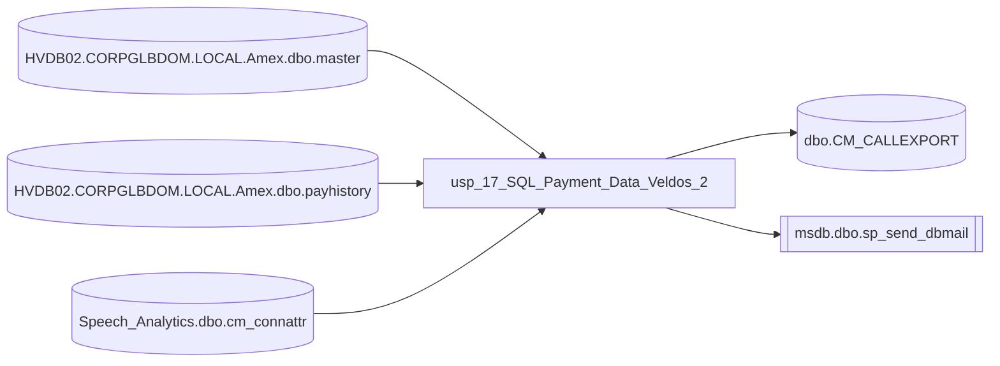

&nbsp;

---

## Metadata

| Server | Database         | Schema | Procedure                        |
| ------ | ---------------- | ------ | -------------------------------- |
| BISQL  | Speech_Analytics | dbo    | usp_17_SQL_Payment_Data_Veldos_2 |

---

## Description

This stored procedure orchestrates a daily refresh of payment information for a specific subset of records. It first determines a date window by identifying the most recent date that already has a payment value and the latest date available for the target group, then shifts the end date back by two days to ensure completeness. Using that window, it pulls payment transaction data from an external source, filters out certain transaction types, and aggregates any multiple payments that may have occurred on the same account and date. The aggregated amounts are then used to update the payment received field in the main call export table for matching accounts and dates, applying the updates only to records belonging to the designated group. After the update, any remaining null payment values within the processed date range are set to zero to maintain consistency for downstream processes. The procedure counts how many records received an updated payment amount, builds a descriptive email subject and body that include the current date and the count, and sends the notification to predefined recipients when at least one record was updated. Throughout the execution, temporary tables are used to stage intermediate results and are cleaned up automatically. The routine is designed to be run on a regular schedule to keep the payment received data current and to provide stakeholders with a summary of the activity.

---

## Parameters

| Parameter | Data Type     | Direction |
| --------- | ------------- | --------- |
| @mail_to  | VARCHAR(1500) | INPUT     |
| @mail_cc  | VARCHAR       | INPUT     |

---

## Declared Variables

| Variable        | Data Type |
| --------------- | --------- |
| @prefix_subject | AS        |
| @Start_Date     | DATE      |
| @Stop_Date      | DATE      |
| @totcnt         | VARCHAR   |
| @body1          | VARCHAR   |
| @subject1       | VARCHAR   |

---

## Code

<SwmSnippet path="/SQL/BISQL/Speech_Analytics/Speech_Analytics/dbo/Stored Procedures/usp_17_SQL_Payment_Data_Veldos_2.sql" line="3" collapsed>

---

&nbsp;

```plsql
-- ================================= ============
-- Author:		Vladislav Pilipets
-- Create date: 2022-05-09
-- Description:	Updates payment received data only for veldos along with dollar amount
-- =============================================
CREATE PROCEDURE [dbo].[usp_17_SQL_Payment_Data_Veldos]
	@mail_profile		varchar(50), 
	@mail_to			varchar(1500), 
	@mail_cc			varchar(1500)
AS  
BEGIN

SET NOCOUNT ON;

DECLARE @prefix_subject AS VARCHAR(50) = (SELECT attributes FROM Speech_Analytics.dbo.cm_connattr WHERE parameter = 'prefix' AND isActive = 1) 

--Same day Payment amount update

--Start date based of the last payment amount updated
DECLARE @Start_Date DATE
SELECT @Start_Date= MAX(calldt) FROM dbo.CM_CALLEXPORT WHERE PAYRCVD IS NOT NULL AND RECDP='Veldos'
PRINT @Start_Date

DECLARE @Stop_Date DATE
SELECT @Stop_Date= CAST(DATEADD(DAY,-2,MAX(CALLDT)) AS DATE ) FROM dbo.CM_CALLEXPORT WHERE RECDP='Veldos'
PRINT @Stop_Date

--Extarcting Same day payment posting based of start and stop date
IF OBJECT_ID('tempdb.dbo.#Results') IS NOT NULL 
DROP TABLE dbo.#Results
SELECT a.[number],CAST(a.[received] AS DATE) rcvd,ROUND(b.totalpaid,0) ttpd,CAST(b.datepaid AS DATE) dtpaid
INTO dbo.#Results
FROM [HVDB02.CORPGLBDOM.LOCAL].[Amex].[dbo].[master] a
INNER JOIN [HVDB02.CORPGLBDOM.LOCAL].[Amex].[dbo].[payhistory] b ON	b.number = a.number 
WHERE b.batchtype NOT IN ('PCR','PUR') AND 
CAST(b.datepaid AS DATE) BETWEEN @Start_Date AND @Stop_Date
ORDER BY CAST(b.datepaid AS DATE)


--adding multiple payments made on sngle account
IF OBJECT_ID('tempdb.dbo.#Results1') IS NOT NULL 
DROP TABLE dbo.#Results1
SELECT a.[number],a.dtpaid,SUM(a.ttpd)  ttpd
INTO dbo.#Results1
FROM dbo.#Results a
GROUP BY  a.[number],a.dtpaid

--Updating the payment data based of filenumber and date of call
UPDATE dbo.CM_CALLEXPORT 
SET PAYRCVD=CAST(a.ttpd AS FLOAT)
FROM dbo.#Results1 a
WHERE CM_CALLEXPORT.RGSACC=CAST(a.number AS NVARCHAR(100)) 
AND CM_CALLEXPORT.CALLDT=a.dtpaid AND CM_CALLEXPORT.RECDP='Veldos'

--Updating the null values as 0 for executing process daily
UPDATE dbo.CM_CALLEXPORT
SET PAYRCVD=0
WHERE CM_CALLEXPORT.PAYRCVD IS NULL AND CM_CALLEXPORT.CALLDT<=@Stop_Date AND RECDP='Veldos'


DECLARE @totcnt VARCHAR (MAX);
SELECT @totcnt=CAST(COUNT(dtpaid) AS varchar) FROM dbo.#Results1
PRINT @totcnt

DECLARE @body1 VARCHAR (MAX); 
		SET @body1 = 'Hi All,
		
Payment Recieved process on Veldos Portal executed for '+convert(varchar,getdate(),23)+'.
		
Total count of accounts with dollar collection updtaed are '+ (@totcnt) +'. 
		

Regards,
Business Analytics';
		print @body1
DECLARE @subject1 VARCHAR (MAX); 
		SET @subject1 = isnull(@prefix_subject,'') + 'Payment Recieved(Veldos) process executed for ' + convert(varchar,getdate(),23);
		print @subject1
	--send email
	if (SELECT count(dtpaid) FROM dbo.#Results1)>0
		EXEC msdb.dbo.sp_send_dbmail
		@profile_name = @mail_profile,
		@from_address ='Reports SpeechAnalytics <reports.speechanalytics@radiusgs.com>',
		@recipients='dw@radiusgs.com;business.analytics@radiusgs.com',

		@copy_recipients=@mail_cc,

		@subject = @subject1,

		@body = @body1;

END
GO
GRANT VIEW DEFINITION
    ON OBJECT::[dbo].[usp_17_SQL_Payment_Data_Veldos] TO [CORP\aramugade]
    AS [dbo];


GO
GRANT VIEW DEFINITION
    ON OBJECT::[dbo].[usp_17_SQL_Payment_Data_Veldos] TO [CORP\tkumar]
    AS [dbo];


GO
GRANT VIEW DEFINITION
    ON OBJECT::[dbo].[usp_17_SQL_Payment_Data_Veldos] TO [CORP\aughodake]
    AS [dbo];


GO
GRANT VIEW DEFINITION
    ON OBJECT::[dbo].[usp_17_SQL_Payment_Data_Veldos] TO [CORP\musalunke]
    AS [dbo];


GO
GRANT VIEW DEFINITION
    ON OBJECT::[dbo].[usp_17_SQL_Payment_Data_Veldos] TO [CORP\pjain]
    AS [dbo];


GO
GRANT VIEW DEFINITION
    ON OBJECT::[dbo].[usp_17_SQL_Payment_Data_Veldos] TO [CORP\mhuang]
    AS [dbo];


```

---

</SwmSnippet>

---

## Data Lineage



---

## Read Tables

| Table                                       |
| ------------------------------------------- |
| HVDB02.CORPGLBDOM.LOCAL.Amex.dbo.master     |
| HVDB02.CORPGLBDOM.LOCAL.Amex.dbo.payhistory |
| Speech_Analytics.dbo.cm_connattr            |

---

## Write Tables

| Table             | Operation |
| ----------------- | --------- |
| dbo.CM_CALLEXPORT | UPDATE    |

---

## Called Procedures

| Procedure               |
| ----------------------- |
| msdb.dbo.sp_send_dbmail |

---

## Point of Contact

[analytics@radiusgs.com](mailto:analytics@radiusgs.com)

<SwmMeta version="3.0.0" repo-id="Z2l0aHViJTNBJTNBR2l0SHViX0ludGVncmF0aW9uX1Rlc3QlM0ElM0FKZWFuLVBpZXJyZS1Qb2xuYXJlZmY=" repo-name="GitHub_Integration_Test"><sup>Powered by [Swimm](https://app.swimm.io/)</sup></SwmMeta>
