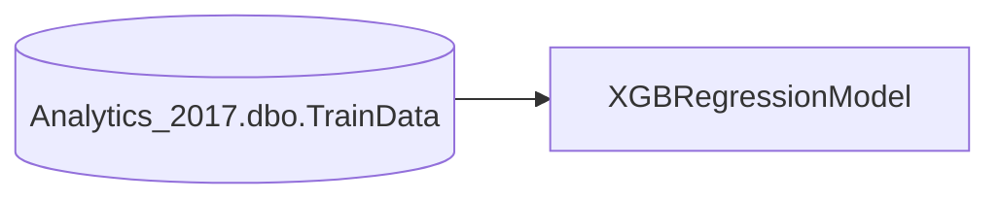

# XGBRegressionModel

---

## Metadata

| Server | Database         | Schema | Procedure          |
| ------ | ---------------- | ------ | ------------------ |
| BISQL  | Client_Analytics | dbo    | XGBRegressionModel |

---

## Description

The stored procedure is designed to train a regression model using the XGBoost algorithm within SQL Server’s external script execution feature. It begins by defining a simple SQL query that retrieves all rows from a table named TrainData in the Analytics_2017 database. This query result is passed as input data to an R script that runs inside the database engine. Inside the R script, the necessary libraries—xgboost for gradient‑boosted trees, dplyr for data manipulation, and Matrix for handling sparse matrices—are loaded. The incoming data frame is processed by removing a specific column that represents the target variable, while the target column itself is retained separately for labeling. The remaining predictor columns are converted into a numeric matrix, which is then wrapped into an XGBoost DMatrix object together with the target labels. An XGBoost model is subsequently trained using this DMatrix, specifying 200 boosting rounds and a linear regression objective. After training, the model object is serialized into a raw binary format. This binary representation is assigned to an output variable that the procedure declares as an varbinary(max) parameter. When the procedure finishes, the binary blob containing the trained XGBoost model is returned to the caller, enabling the model to be stored, transferred, or used for scoring in other processes without exposing the underlying R code or intermediate data. The overall purpose is to encapsulate model training and export within a single database call.

---

## Parameters

| Parameter      | Data Type      | Direction |
| -------------- | -------------- | --------- |
| @trained_model | VARBINARY(MAX) | OUTPUT    |

---

## Declared Variables

| Variable | Data Type     |
| -------- | ------------- |
| @inquery | NVARCHAR(MAX) |

---

<SwmSnippet path="/SQL/BISQL/Client_Analytics/Client_Analytics/dbo/Stored Procedures/XGBRegressionModel.sql" line="3" collapsed>

---

&nbsp;

```plsql
CREATE    PROCEDURE [XGBRegressionModel] (@trained_model varbinary(max) OUTPUT)
AS 
BEGIN
  DECLARE @inquery nvarchar(max) = N'
  SELECT  * FROM Analytics_2017.dbo.TrainData

'
  EXEC sp_execute_external_script @language = N'R',
                                  @script = N'
## Create model
		library(xgboost)
        library(dplyr)
        library(Matrix)
		   
		ModelDataP=data.frame(select(ModelData,-PaidOnAccountAmt))

		Data_matrix=xgb.DMatrix(data = as.matrix(ModelDataP), label = ModelData$PaidOnAccountAmt)

		h_model=xgb.train(data=Data_matrix,
                  nrounds=200,
                  objective = "reg:linear")
 ## Serialize model 

		trained_model <- as.raw(serialize(h_model, connection=NULL));  
'
 ,@input_data_1 = @inquery
 , @input_data_1_name = N'ModelData'
 , @params = N'@trained_model varbinary(max) OUTPUT'
 ,@trained_model = @trained_model OUTPUT; 
```

---

</SwmSnippet>

## Data Lineage



---

## Read Tables

| Table                        |
| ---------------------------- |
| Analytics_2017.dbo.TrainData |

---

## Write Tables

*No write tables.*

---

## Called Procedures

*No external procedures called.*

---

## Point of Contact

[analytics@radiusgs.com](mailto:analytics@radiusgs.com)

<SwmMeta version="3.0.0" repo-id="Z2l0aHViJTNBJTNBR2l0SHViX0ludGVncmF0aW9uX1Rlc3QlM0ElM0FKZWFuLVBpZXJyZS1Qb2xuYXJlZmY=" repo-name="GitHub_Integration_Test"><sup>Powered by [Swimm](https://app.swimm.io/)</sup></SwmMeta>
